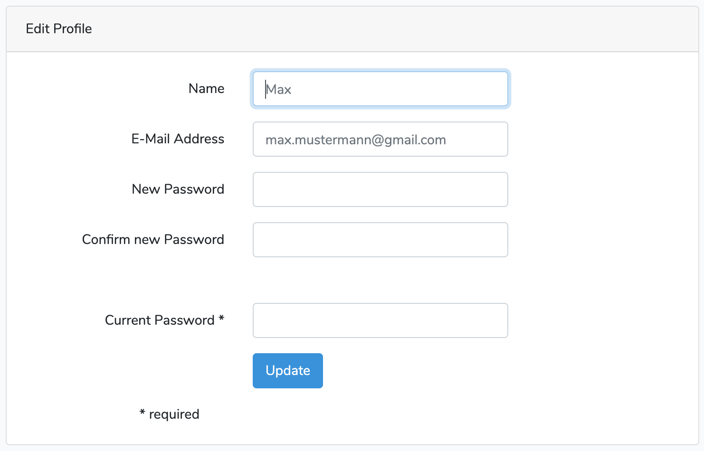

# Laravel - User Service

## Description

This is a Laravel project showcasing how an app can be build
with this framework via a simple user service with basic CRUD functions.

## Getting started

Setting up a Laravel development environment can be overwhelming at first. Therefore, some tools are being used to make this process more straightforward.

### Requirements

- [docker](https://www.docker.com/) (& docker-compose) are installed
- [ddev](https://ddev.readthedocs.io/en/latest/) is installed

### Start up

- open a terminal in the root directory of the project
- run `bash setup.sh` to configure the app
- run `ddev launch` to start the app

The app should automatically open up in your standard browser.
If that is not the case, you should find it under the following address:  http://laravel-userservice.ddev.site/.

## Links

Learn more about [Laravel](https://laravel.com/).
